＃fs積算System（Ver11.3）

　Excel/VBA で作成した土木工事向け積算支援ツール「fs積算System」の公開リポジトリです。
 
  数量計算書・内訳書・予算書の作成、単価管理など、積算業務を効率化するフリーソフトです。

## ■ 主な機能
   1. 土木工事内訳書の流れに準拠
   2. 代価項目実行を利用し、過去積算ファイルからデータ追記可能
   3. 労務単価は30種以上を搭載、単価変更も可能
   4. 資材・外注シートの記述を代価・単価表に利用可能
   5. 資材・外注・労務単価変更による予算内訳の一括変更
   6. 機械単価実行では、各社に合わせた損料を入力可能
   7. 代価表・単価表データを代価項目実行に登録し、他積算へ再利用
   8. 見積依頼書（資材・外注）および添付ファイルをE-mail発行（Microsoft CDO for Windows 2000 Library）必要
   9. 見積条件の作成
  10. 見積書作成・法定福利費計算
  11. 見積遍歴の作成
  12. 見積書を顧客へ、予算書を社内へE-mail送信
  13. 受注報告書の作成
  14. 実行予算書の代価表・単価表をExcelファイル化、稟議書作成
  15. 出来高調書（対契約用・社内用）の作成
  16. 外注・資材購入稟議書の添付
  17. 過去積算済ファイルから「代価項目実行」へデータ追加
  18. E-MailDataファイルを本体プログラムへ登録可能
  19. 積算済の資材・外注単価総括表を作成し発注単価を確認可能
  20. [fs積算] フォルダ変更にも対応
  21. 元請時の法定福利費・労災保険料を現場経費にて計上
  22. 代価・単価表などを20ページ毎にファイル化
  23. 実行予算稟議作成ファイルが多工種に対応
  24. fsStart画面を更新
  25. 令和8年度労務単価・法定福利費率（国交省・農林省）を採用
  26. 建設業改訂に伴う「材料費・労務費・法定福利費・建退共・安全衛生経費」マクロを実装

## 主な画面

### Start（起動画面）
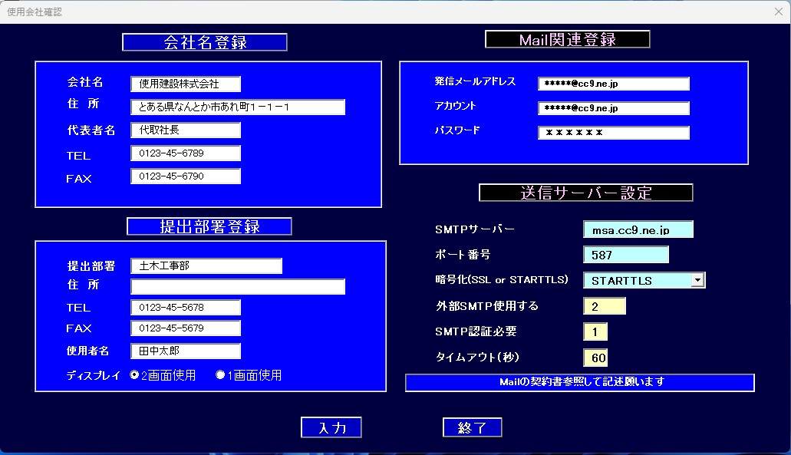
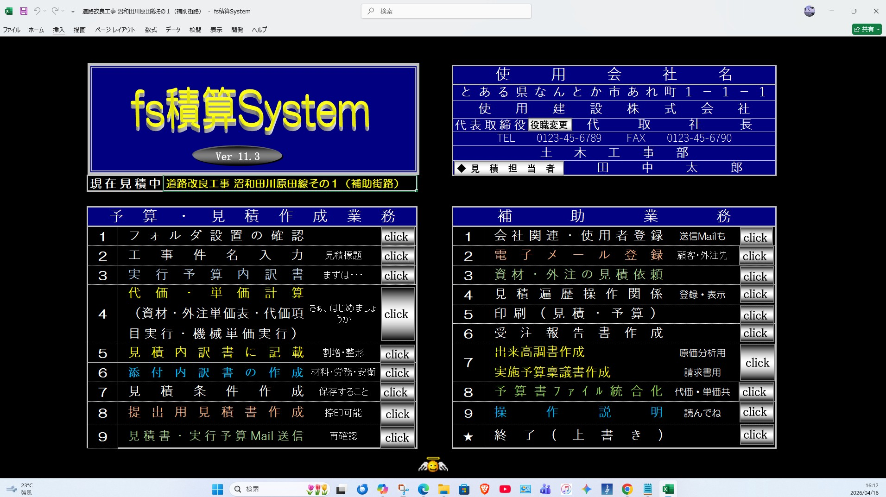

### 積算開始
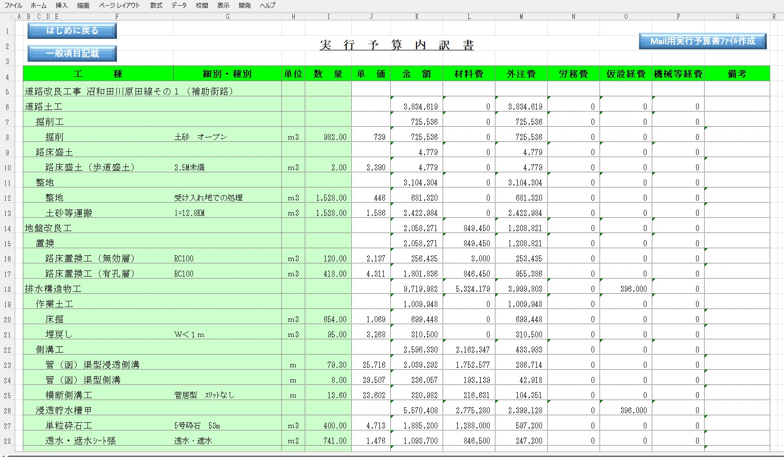
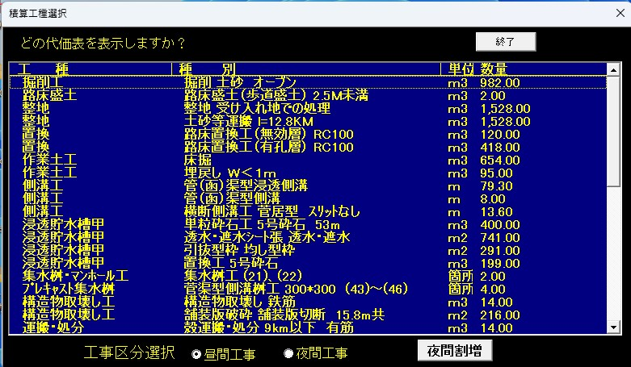
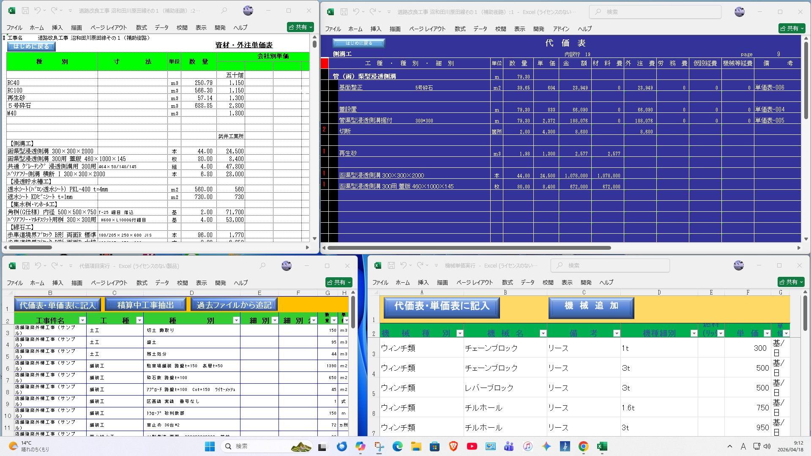

### 見積書
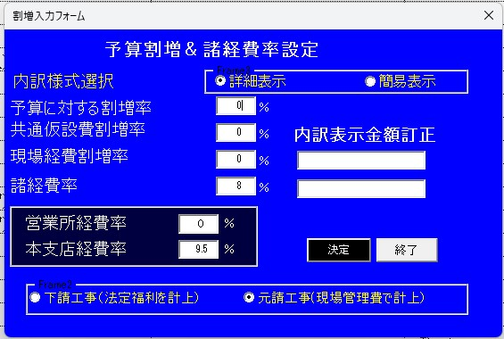
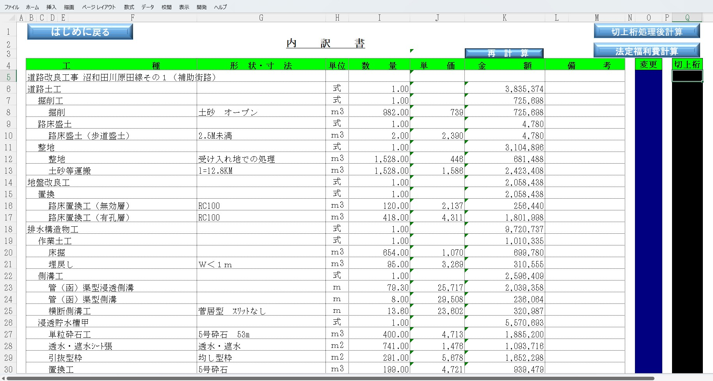
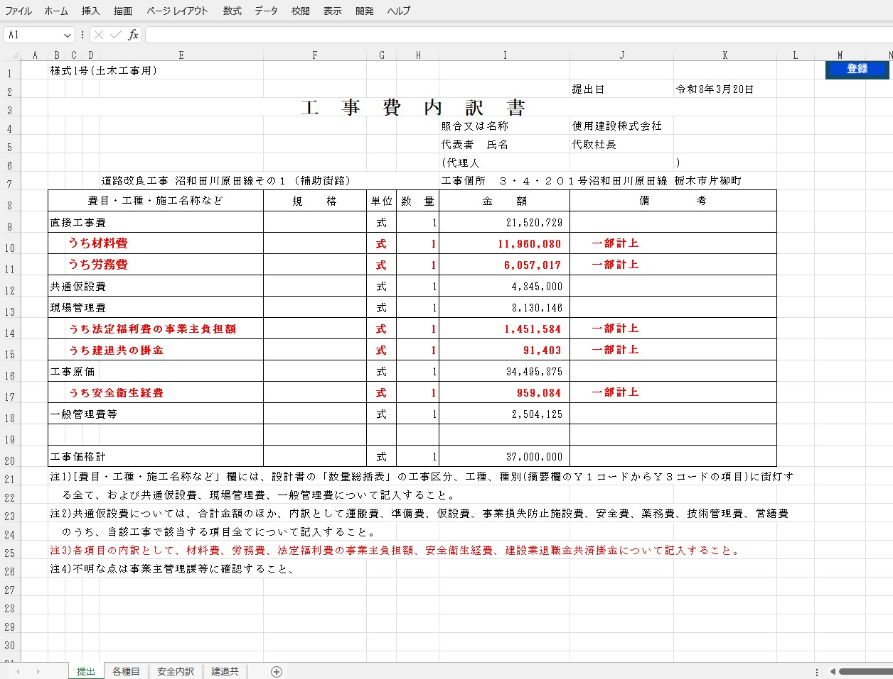

### 補助業務
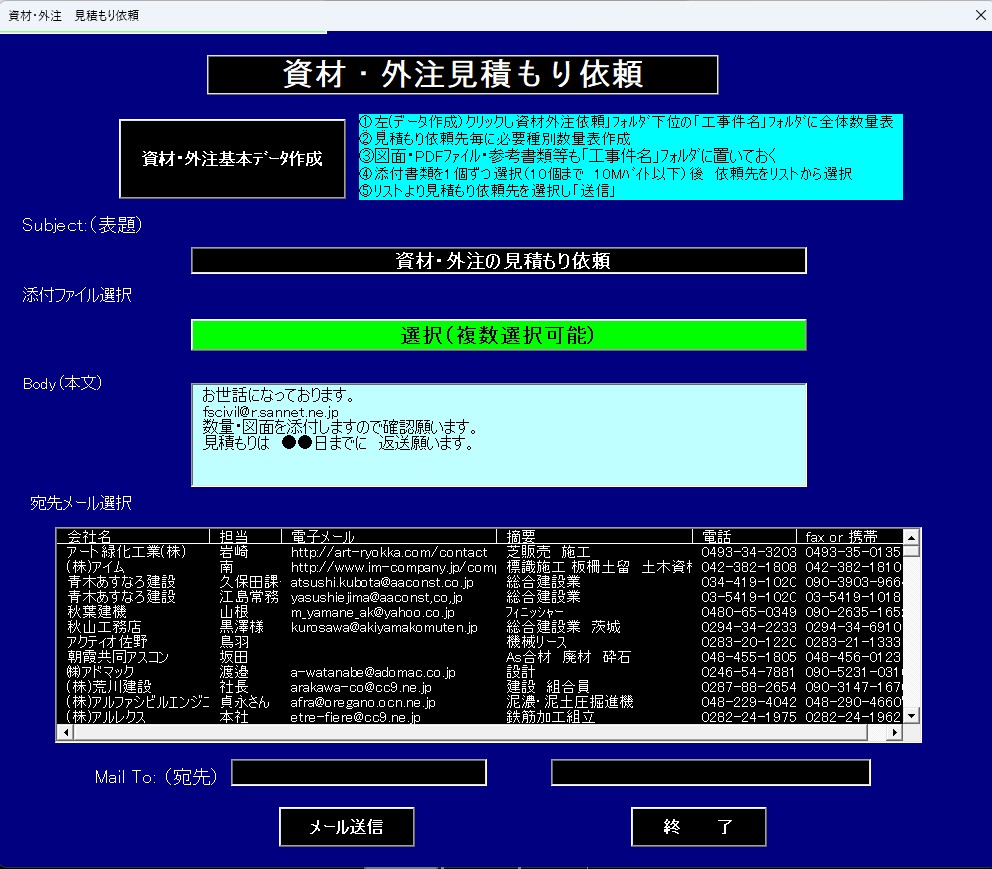
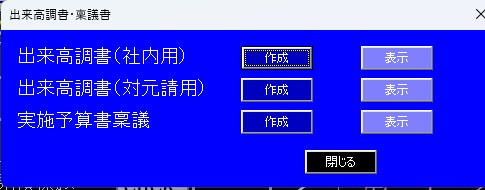
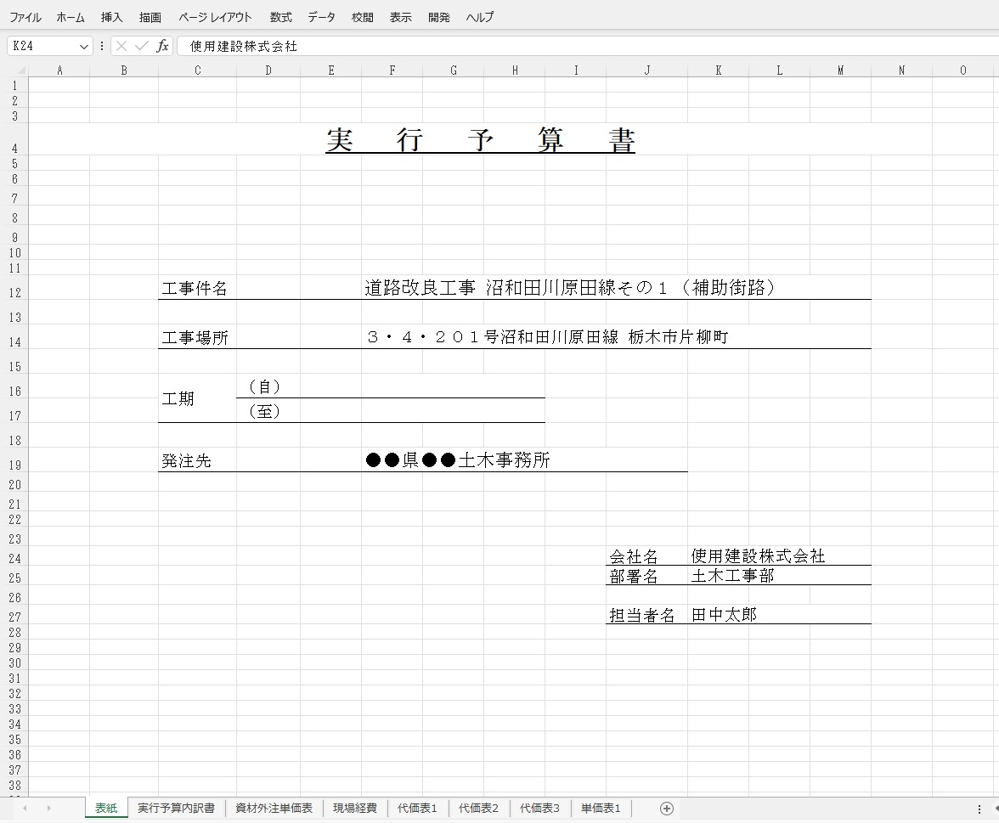

### fsStart
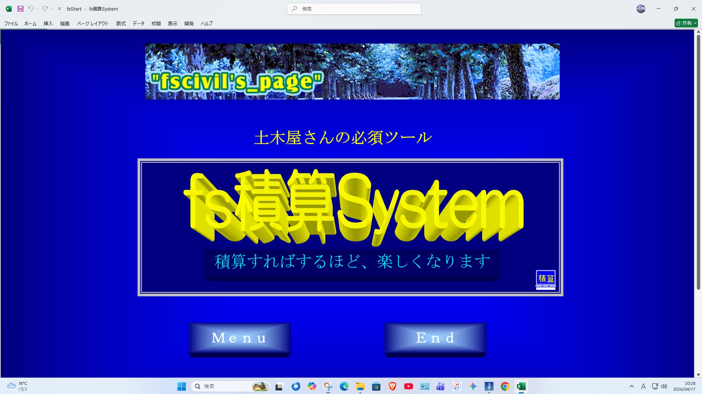
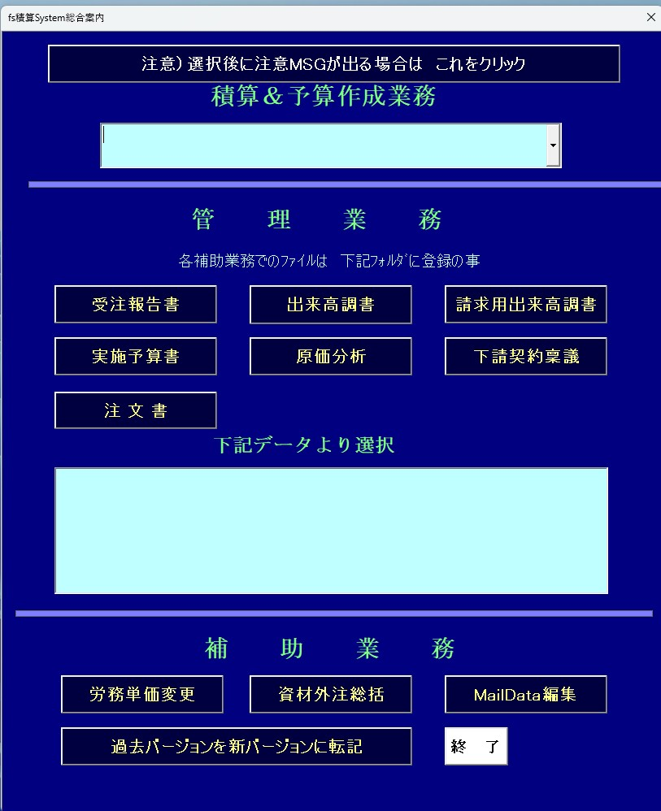

## ■ 動作環境
 　　・Windows 10 / 11  
　　 ・Microsoft Excel 2016 以降（VBA が使用可能な環境）

## ■ インストール方法
　　 1. 本リポジトリの **Releases** または **ZIP ファイル** をダウンロード  
　　 2. ZIP を任意のフォルダに展開  （C:¥fs積算）
　　 3. Excel マクロを有効にして起動  
　　 4. `fs積算System.xlsm` を開くと利用できます

```
## ファイル構成

fs積算
├─ fsStart.xlsm（補助ファイル）
├─ 下請け契約稟議
├─ 契約稟議書
├─ 出来高調書
├─ 原価分析書
└─ 積算＆予算
    ├─ fs積算System.xlsm（メインファイル）
    ├─ data
    ├─ Mail内訳
    ├─ 資材外注依頼
    ├─ 資料
    ├─ 代価項目実行退避
    ├─ 実行予算
    └─ sound
```

 
## ■ ライセンス
　　　本ソフトはフリーソフトです。  
　　　商用利用・業務利用も可能ですが、再配布・改変はご相談ください。

## ■ 作者
 　　 fscivil
 　　 E-mail:fscivil@r.sannet.ne.jp

## ■ お問い合わせ
 　　不具合報告・改善要望などは Issues からお願いします。 
